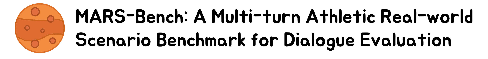
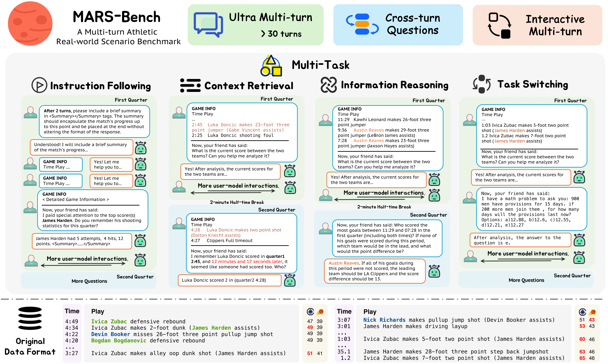

<div align="center">
<p align="center" width="100%">

</p>

<p align="center">
  <a href="https://github.com/syuchin/MARS-Bench/stargazers">
    </a>
  <a href="https://syuchin.github.io/MARS-Bench/">
    </a>
  <a href="https://arxiv.org/abs/2505.14552">
    </a>
  <a href="LICENSE">
    </a>
</p>
</div>

<div align="center">

Chenghao Yang<sup style="color:#8a2be2;">1,2</sup><sup style="color:#ff6b6b;">\*</sup><sup style="color:#4ecdc4;">‡</sup>, Yinbo Luo<sup style="color:#4682b4;">2</sup><sup style="color:#ff6b6b;">\*</sup>, Zhoufutu Wen<sup style="color:#8a2be2;">1</sup><sup style="color:#2e8b57;">†</sup>, Qi Chu<sup style="color:#4682b4;">2</sup><sup style="color:#2e8b57;">†</sup>, Tao Gong<sup style="color:#4682b4;">2</sup>, Longxiang Liu<sup style="color:#8a2be2;">1</sup>, Kaiyuan Zhang<sup style="color:#8a2be2;">1</sup>, Jianpeng Jiao<sup style="color:#8a2be2;">1</sup>, Ge Zhang<sup style="color:#8a2be2;">1</sup>, Wenhao Huang<sup style="color:#8a2be2;">1</sup>, Nenghai Yu<sup style="color:#4682b4;">2</sup>

<sup style="color:#8a2be2;">1</sup>ByteDance Seed, <sup style="color:#4682b4;">2</sup>University of Science and Technology of China

<sup style="color:#ff6b6b;">*</sup>Equal Contribution, <sup style="color:#2e8b57;">†</sup>Corresponding Authors, <sup style="color:#4ecdc4;">‡</sup>Work done at ByteDance Seed

</div>

---

## 🔔 Introduction

<p align="center">
   
</p>

**MARS-Bench** is a real-world multi-turn dialogue benchmark that reveals LLM weaknesses in Ultra Multi-turn, Interactive Multi-turn, and Cross-turn Tasks. Built on play-by-play sports commentary, it offers a rigorous evaluation suite and insights into attention sink phenomena and explicit reasoning.

---

## ⚙️ Installation

To install the required packages:

```bash
git clone https://github.com/syuchin/MARS-Bench.git
cd MARS-Bench
# we prefer to run the code in a conda environment
conda create -n mars-bench python=3.10
conda activate mars-bench
pip install -r requirements.txt
```

---

## 🚀 Quick Start

You can quick start like this:

1️⃣ Configure the `config/config.yaml` with your API keys (OpenAI, DeepSeek, etc.).

2️⃣ Run a single-game demo:

```bash
python chat/demo.py --model_name deepseek-chat --game_id 166909 --data_path data/Context_Retrieval.jsonl
```

3️⃣ Process a specific data file:

```bash
python chat/chat.py --input_file data/Context_Retrieval.jsonl --output_path result/chat-result/chat-test.json --model_name deepseek-chat
```

4️⃣ Conduct evaluation:

```bash
python eval/eval.py --input result/chat-result/chat-test.json --output result/eval-result/chat-test-eval.json
```

---

## 🛠️ Project Structure

### eval

* `eval.py`: Main evaluation script, calculates metrics.
* `deepseek_api.py`: Evaluation-specific DeepSeek API implementation.

### chat

* `chat.py`: Processes full dataset for multi-turn dialogues.
* `demo.py`: Single-game demo script.
* `models/`: Contains model API wrappers (e.g., `deepseek_api.py`, `openai_api.py`).

### data

* `*.jsonl`: JSONL files with dialogue data of different tasks.

### config

* `config.yaml`: API keys and model settings.
* `config_wrapper.py`: Helper for loading configurations.

### result

* `chat-result/`: Dialogue outputs (e.g., `demo.json`).
* `eval-result/`: Evaluation results.
